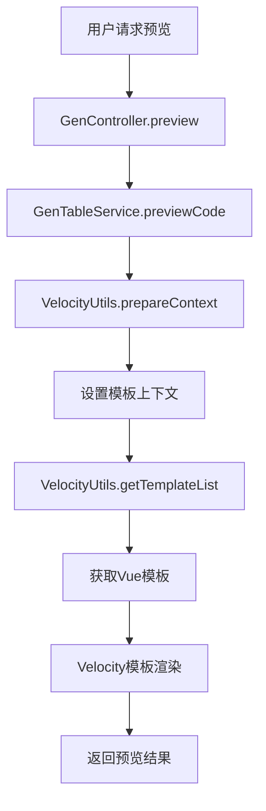
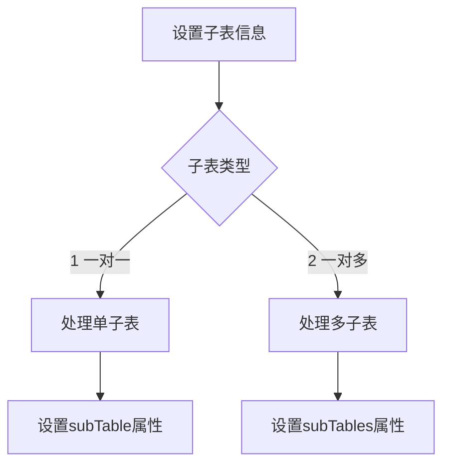
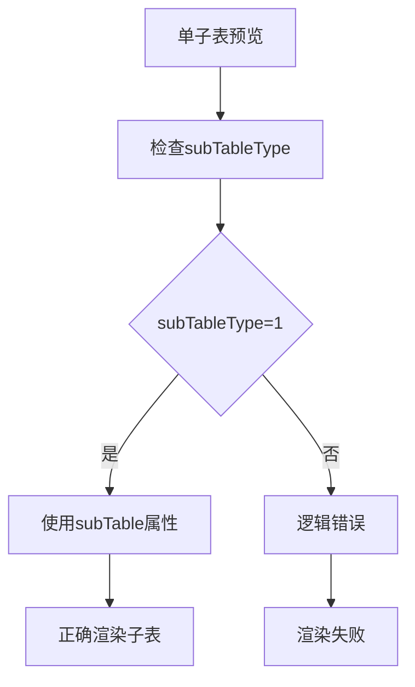
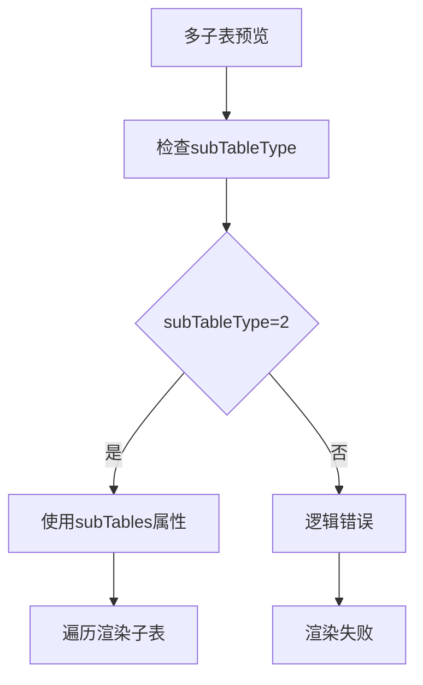

# 代码生成器预览功能错误修复设计文档

## 1. 概述

### 1.1 问题背景
RuoYi-Vue代码生成器模块的预览功能存在多处错误，特别是在处理单子表和多子表预览时出现语法错误和逻辑错误，导致预览功能无法正常使用。

### 1.2 问题范围
- 单子表预览功能错误
- 多子表预览功能错误
- Vue模板语法错误
- Velocity模板引擎使用不当
- 子表类型处理逻辑不完善

## 2. 系统架构

### 2.1 整体架构
代码生成器预览功能基于以下组件构建：
- **前端**: Vue.js + Element UI
- **后端**: Spring Boot + Velocity模板引擎
- **数据库**: MySQL

### 2.2 核心组件交互

## 3. 数据模型

### 3.1 GenTable实体
| 字段名 | 类型 | 说明 |
|-------|------|-----|
| tableId | Long | 表ID |
| tableName | String | 表名 |
| subTableName | String | 子表名(一对一) |
| subTableNames | String | 子表名集合(一对多) |
| subTableFkName | String | 外键名(一对一) |
| subTableFkNames | String | 外键名集合(一对多) |
| subTableType | Integer | 子表关系类型(1:一对一, 2:一对多) |
| subTable | GenTable | 子表对象(一对一) |
| subTables | List<GenTable> | 子表对象集合(一对多) |

### 3.2 子表类型处理逻辑

## 4. 业务逻辑层设计

### 4.1 预览功能流程
1. 用户请求预览指定表的代码
2. 控制器调用服务层预览方法
3. 服务层查询表信息并设置子表关系
4. 准备Velocity模板上下文
5. 渲染所有相关模板
6. 返回渲染结果给前端展示

### 4.2 核心方法分析

#### 4.2.1 VelocityUtils.prepareContext方法
负责准备Velocity模板渲染所需的上下文信息，包括：
- 基本表信息设置
- 子表信息处理（根据subTableType区分处理）
- 树形表信息处理
- 菜单信息设置

#### 4.2.2 VelocityUtils.setSubVelocityContext方法
专门处理主子表关系的上下文设置：
- 当subTableType=1时，处理一对一关系
- 当subTableType=2时，处理一对多关系

#### 4.2.3 VelocityUtils.getTemplateList方法
获取需要渲染的模板列表，强制使用Vue3模板路径。

## 5. 模板设计与错误分析

### 5.1 Vue模板结构
Vue模板分为以下几个部分：
1. 查询表单区域
2. 表格展示区域
3. 对话框表单区域
4. JavaScript逻辑区域

### 5.2 已识别的错误类型

#### 5.2.1 语法错误
- 变量引用语法不统一：混用`${column.javaField}`和`$column.javaField`
- JavaScript属性访问错误：混用`this.form.${subclassName}List`和`this.form["${subclassName}List"]`
- 子表数据访问语法错误：`scope.row.$javaField`应为`scope.row.${javaField}`

#### 5.2.2 逻辑错误
- 子表类型判断逻辑不完善
- 多子表处理逻辑缺失
- 子表数据绑定错误
- 子表类型切换时数据清理不完整

#### 5.2.3 数据访问错误
- 子表数据访问路径不正确
- 多子表数据遍历逻辑错误
- 子表外键名获取逻辑错误

### 5.3 单子表预览错误分析

### 5.4 多子表预览错误分析

## 6. 修复方案

### 6.1 后端修复

#### 6.1.1 VelocityUtils类修复
1. 完善setSubVelocityContext方法的子表类型处理逻辑
2. 统一变量引用语法为`${column.javaField}`
3. 修复子表数据访问逻辑
4. 完善getSubTableFkName方法的外键名获取逻辑
5. 修复多子表信息设置逻辑，确保每个子表的外键名正确传递

#### 6.1.2 GenTableService类修复
1. 完善setSubTable方法的子表类型处理逻辑
2. 确保预览时正确设置子表信息

### 6.2 前端模板修复

#### 6.2.1 index.vue.vm模板修复
1. 统一变量引用语法，修复`scope.row.$javaField`为`scope.row.${javaField}`
2. 修复子表类型判断逻辑
3. 完善多子表遍历渲染逻辑
4. 修复JavaScript属性访问语法
5. 完善子表外键名传递逻辑
6. 修复多子表数据绑定逻辑，确保每个子表的数据独立处理

### 6.3 修复验证
1. 单子表预览功能验证
2. 多子表预览功能验证
3. 语法正确性验证
4. 渲染结果正确性验证

## 7. 修复实施步骤

### 7.1 修复VelocityUtils类
1. 修改`ruoyi-generator/src/main/resources/vm/vue/v3/index.vue.vm`文件中的`scope.row.$javaField`为`scope.row.${javaField}`
2. 完善setSubVelocityContext方法中多子表信息设置逻辑

### 7.2 修复Vue模板
1. 统一所有变量引用语法为`${column.javaField}`格式
2. 完善多子表数据绑定逻辑

## 8. 修复前后对比

### 8.1 修复前问题
1. Vue模板中存在语法错误：`scope.row.$javaField`
2. 多子表处理逻辑不完善
3. 子表外键名传递不正确

### 8.2 修复后效果
1. Vue模板语法统一且正确
2. 单子表和多子表预览功能正常
3. 子表数据绑定正确

## 7. 测试策略

### 7.1 单元测试
- VelocityUtils类单元测试
- GenTableService类单元测试
- Vue模板语法正确性测试

### 7.2 集成测试
- 单子表预览功能测试
- 多子表预览功能测试
- 模板渲染结果验证
- 生成代码语法正确性验证

### 7.3 验收测试
- 实际生成预览代码验证
- 代码语法正确性检查
- 功能完整性验证
- 单子表和多子表预览功能完整验证